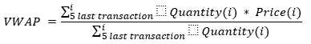

# VWAP test

## Prerequisite

You need an internet connection to download the dependencies of this project.

And a JDK installed. Any recent JDK should be good as this project has been tested using Java 8, Java 11 and Java 17.

## Gradle

In this documentation when `gradlew` is used it means `gradlew.bat` for Windows and `./gradlew` for Unix-like OS.

This practice is a [Gradle](https://gradle.org) Java project.

Recent IDEs, like [Eclipse](https://www.eclipse.org/downloads/)
or [IntelliJ IDEA](https://www.jetbrains.com/idea/download/), are able to open the `build.gradle` file as a project file
and achieve all the required setup.

## Practice

### Background

The goal of this test is to compare data coming from a provider and react to given conditions.

The provider notifies two types of data:

- Pricing Data: Fair Value of a product, calculated by an internal system
- Market Data: Quantity and Price of the latest exchange transaction on a product

### Functionality to implement

#### Pricing Data

Starting in the `com.hsoft.practice.VwapTrigger` class you will receive Pricing Data through the `fairValueChanged`
method.

Example:

- fairValueChanged(“P1”, 11.0)
    - => Fair Value for P1 is 11.0
- fairValueChanged(“P1”, 10.9)
    - => Fair Value for P1 is 10.9
- fairValueChanged(“P2”, 12.5)
    - => Fair Value for P1 is unchanged
    - => Fair Value for P2 is 12.5

#### Market Data

Still in the `com.hsoft.practice.VwapTrigger` class you will receive Market Data through the `transactionOccurred`
method. Using these Market Data we ask you to the `Volume Weighted Average Price` (VWAP) over the five last transactions
received for each product.

Where VWAP formula is: 

If less than five transactions were reported on a given product, the VWAP will be calculated using all the transactions
available for this product.

Example:

- transactionOccurred(“P1”, 1000, 10.0)
    - => VWAP for P1 = 1000 * 10.0 / 1000 = 10.0
- transactionOccurred(“P1”, 2000, 11.0)
    - => VWAP for P1 = (1000 * 10.0 + 2000 * 11.0) / (1000 + 2000) = 10.6666666
- transactionOccurred(“P2”, 500, 12.0)
    - => VWAP for P1 is unchanged
    - => VWAP for P2 = (500 * 12.0) / (500) = 12.0

#### Pricing Data versus VWAP

Each time a new transaction occurs, or a new fair value is provided, compare the latest VWAP with the latest Fair Value.
If the VWAP is greater than the Fair Value, then trigger an event to the `vwapTriggerListener` using
its `vwapTriggered(...);` method. See `com.hsoft.practice.VwapTrigger`.

### Test Result

To validate your solution you must execute `gradlew test`. It will execute two unit tests expecting events (the
ones that you will trigger when comparing the latest VWAP with the latest Fair Value), and will ensure that the Fair
Price and VWAP are the expected one for some products.

1. `ExpectationTest.singleThreaded`: the same thread will be used to notify all Pricing Data and Market Data. This test
   is
   mandatory.
2. `ExpectationTest.multiThreaded`: several threads will be used to notify Pricing Data and Market Data. It means that
   you can
   receive Pricing Data for different products at the "same time". Or receive Pricing Data while receiving Market Data (
   and vice-versa).
   To pass this test your code must be **thread-safe**. This test is optional if you are not confident with
   multi-threading.

In addition of these provided tests you can add your own tests in the `com.hsoft.practice.VwapTriggerTest`, and/or in
another `XxxxTest` class.
They will be also executed by `gradlew test`

A tests report will be available, and should be located under `build/reports/tests/test/index.html`. You can also run
the test(s) in your IDE.

### Notes

  - This project comes with internal classes to be able to generate and test your implementation. These classes are located
in `com.hsoft.internal` package. Candidate must not modify them and you don't need to check/understand them to achieve
this practice.
Actually a simple obfuscation has been achieved on these classes to show that they are not important to resolve the
practice. They must be seen as a black-box library.
 - Log4j2 is available and can be used to log. 
 - Solution must be provided as if the produced code will be put in production.
 - Lastly don't hesitate to ask question if you are blocked during the practise. Something can be not clear, or you may
encounter issue due to your local setup, or you reach a edge case not supported by the internal/black-box code.    

